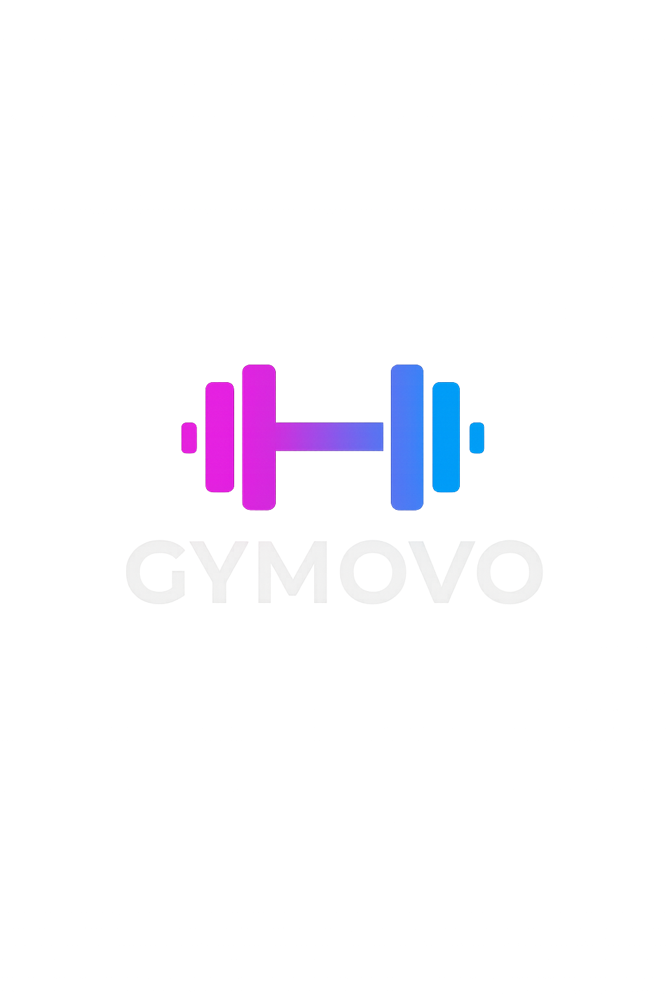

# 💪 Gymovo - אפליקציית הכושר החכמה

<div align="center">
  
  
  <p>אפליקציה מתקדמת לניהול אימונים, מעקב התקדמות ויצירת תוכניות כושר מותאמות אישית</p>

[](https://expo.dev)
[](https://reactnative.dev)
[](https://typescriptlang.org)
[](https://github.com/Yehuda-sh/Gymovo)

</div>

---

## 🎯 תכונות עיקריות

### 🏋️ ניהול אימונים מתקדם

- **אימונים פעילים** - מעקב בזמן אמת עם טיימר מנוחה וחישוב נפח
- **היסטוריית אימונים** - שמירת כל האימונים עם סטטיסטיקות מפורטות
- **שיאים אישיים** - זיהוי אוטומטי והצגת השיאים החדשים שלך
- **דירוג אימונים** - מערכת דירוג ומוד לכל אימון

### 🧠 תוכניות AI חכמות

- **שאלון חכם** - יצירת תוכניות מותאמות אישית לפי השאלון
- **מחולל תוכניות AI** - אלגוריתם מתקדם ליצירת תוכניות אימון
- **תוכניות מוכנות** - גישה לתוכניות מקצועיות מ-[WGER API](https://wger.de/api/v2/)
- **עריכת תוכניות** - כלי עריכה מתקדמים ליצירת תוכניות מותאמות

### 📊 מעקב ואנליטיקה

- **דשבורד אישי** - סקירה כוללת של הפעילות השבועית והחודשית
- **גרפים וסטטיסטיקות** - ויזואליזציה של ההתקדמות לאורך זמן
- **מעקב מדדים** - משקל, אחוזי שומן, מידות גוף ועוד
- **יעדים והישגים** - מערכת יעדים ורמות עם בדג'ים

### 👤 ניהול פרופיל מתקדם

- **פרופיל משתמש מלא** - מידע אישי, יעדים, פציעות והעדפות
- **הגדרות מותאמות** - נושאות, יחידות מידה, התראות ועוד
- **מצב אורח** - גישה לפיצ'רים בסיסיים ללא הרשמה
- **סנכרון מקומי** - כל הנתונים נשמרים במכשיר שלך

## 🛠️ מחסנית טכנולוגית

### Frontend

- **React Native 0.79.5** - פיתוח רב-פלטפורמי
- **Expo 53.0.17** - פלטפורמת פיתוח ופריסה
- **TypeScript 5.8.3** - בטיחות סוגים מלאה (99.4% מהקוד)
- **React Navigation 7.x** - ניווט מתקדם

### ניהול מצב

- **WorkoutStore** - ניהול אימונים פעילים והיסטוריה
- **UserStore** - מידע משתמש והעדפות
- **PlanEditorStore** - עריכת תוכניות אימון

### שירותים

- **WgerAPI** - אינטגרציה עם מאגר התרגילים
- **PlanGenerator** - יצירת תוכניות באמצעות AI
- **Storage** - ניהול אחסון מקומי מתקדם
- **UserPreferences** - ניהול הגדרות משתמש

## 📊 בדיקות

### בדיקות יחידה

```bash
npm test                # הרצת כל הבדיקות
npm run test:watch      # מצב צפייה
npm run test:coverage   # דוח כיסוי
```

## 📦 פריסה

### Android

```bash
npm run build:android
```

### iOS

```bash
npm run build:ios
```

### דרישות מערכת

- **Android** - API 21+ (Android 5.0)
- **iOS** - iOS 13.0+
- **RAM** - מינימום 2GB מומלץ
- **אחסון** - 100MB שטח פנוי

## 🐛 בעיות ופתרונות

### בעיות נפוצות

**האפליקציה לא עולה**

```bash
npm install
npx expo install --fix
```

**שגיאות TypeScript**

```bash
npm run type-check
```

**בעיות Metro bundler**

```bash
npx expo start --clear
```

### קבלת תמיכה

- צור [Issue](https://github.com/Yehuda-sh/Gymovo/issues) ב-GitHub
- בדוק את [הדוקומנטציה של Expo](https://docs.expo.dev/)
- בדוק את [המדריכים](https://docs.expo.dev/guides/)

## 🤝 תרומה

אנחנו מקבלים בברכה תרומות! בואו נעבוד יחד כדי לשפר את Gymovo.

### איך לתרום?

1. Fork את [הפרוייקט](https://github.com/Yehuda-sh/Gymovo)
2. צור branch חדש (`git checkout -b feature/amazing-feature`)
3. Commit השינויים (`git commit -m 'Add amazing feature'`)
4. Push ל-branch (`git push origin feature/amazing-feature`)
5. פתח [Pull Request](https://github.com/Yehuda-sh/Gymovo/pulls)

### הנחיות פיתוח

- עקוב אחר סטנדרטי הקוד הקיימים
- כתוב בדיקות לפיצ'רים חדשים
- עדכן את התיעוד בהתאם
- השתמש בהודעות commit ברורות

## 📈 סטטיסטיקות פרוייקט


- **78 Commits** - פיתוח פעיל ומתמשך
- **TypeScript 99.4%** - קוד בטוח ואמין
- **0 Issues פתוחות** - יציבות גבוהה

## 📱 צילומי מסך

_צילומי מסך יתווספו בקרוב..._

## 🔗 קישורים שימושיים

- **רפוזיטורי**: [GitHub](https://github.com/Yehuda-sh/Gymovo)
- **תיעוד Expo**: [docs.expo.dev](https://docs.expo.dev/)
- **React Native**: [reactnative.dev](https://reactnative.dev/)
- **TypeScript**: [typescriptlang.org](https://typescriptlang.org/)

## 📄 רישיון

פרוייקט זה זמין תחת רישיון MIT. ראה את קובץ הרישיון לפרטים נוספים.

## 📞 יצירת קשר

- **GitHub**: [@Yehuda-sh](https://github.com/Yehuda-sh)
- **Issues**: [דווח על בעיה](https://github.com/Yehuda-sh/Gymovo/issues)
- **Discussions**: [דיונים](https://github.com/Yehuda-sh/Gymovo/discussions)

---

<div align="center">
  <p>נוצר עם ❤️ על ידי <a href="https://github.com/Yehuda-sh">Yehuda Shalev</a></p>
  <p>⭐ אם אהבת את הפרוייקט, תן לו כוכב!</p>
  <p>© 2024 Gymovo. כל הזכויות שמורות.</p>
</div>
